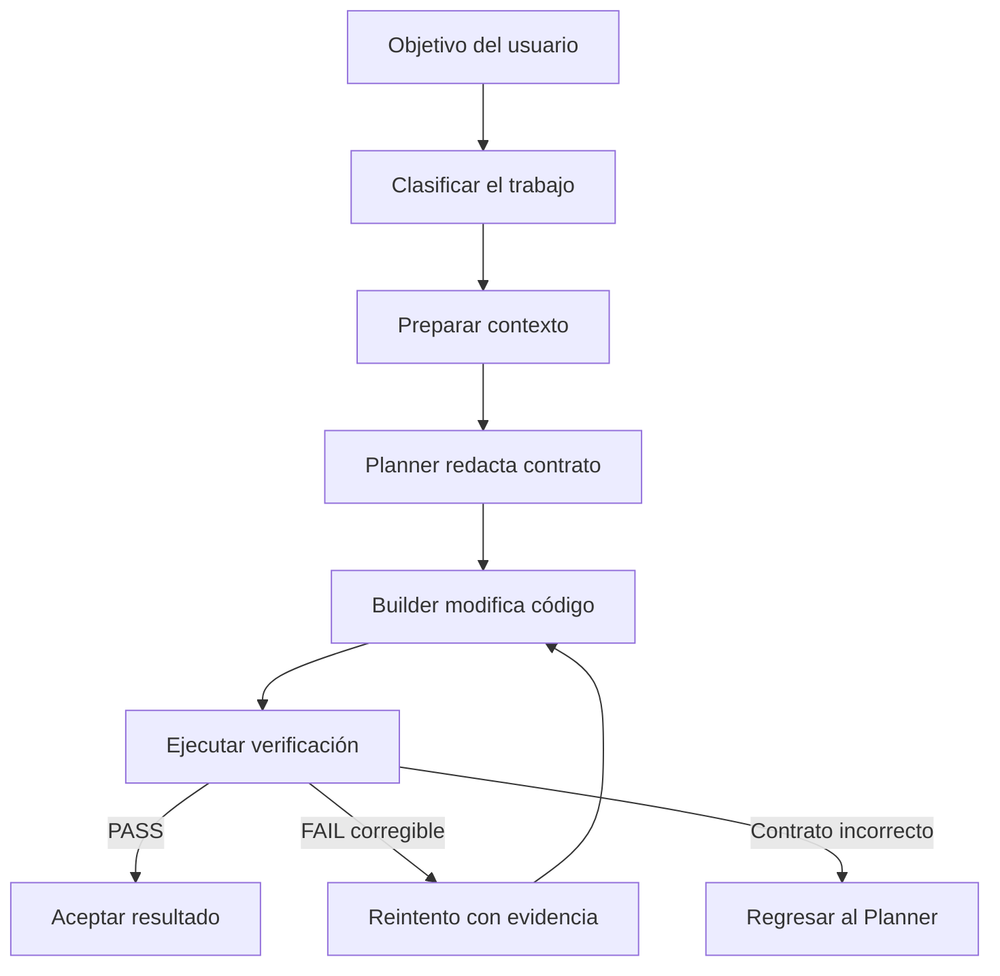
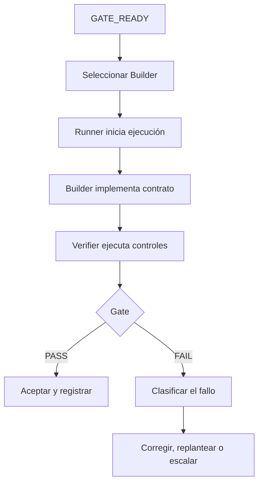
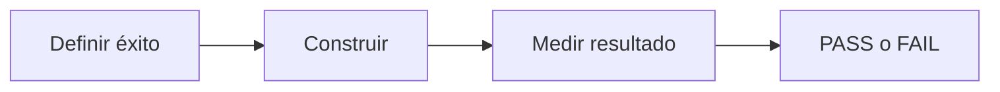
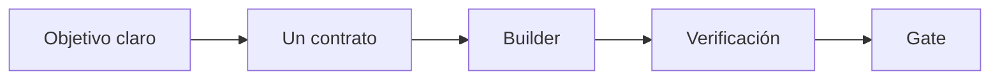
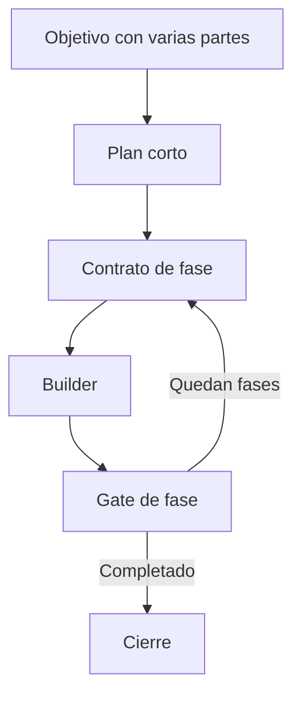
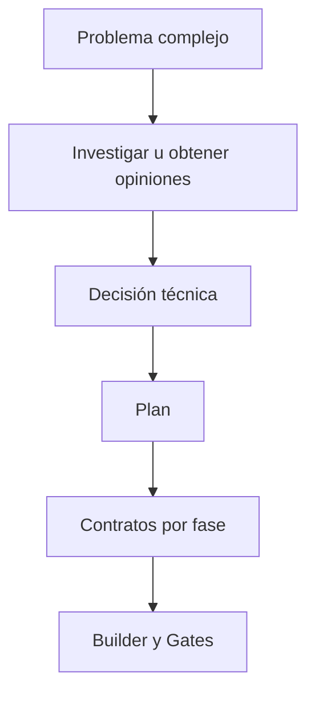
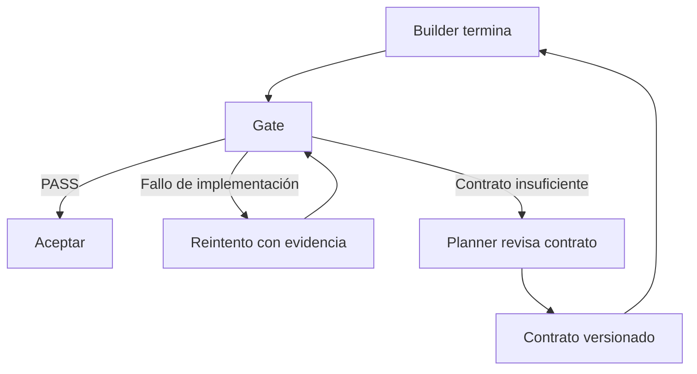
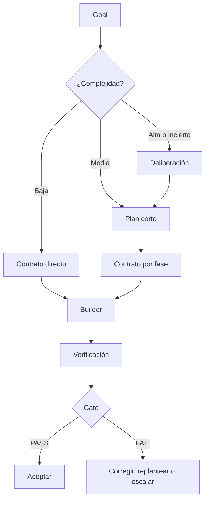

# Flujo para la generación de código

**Estado:** diseño conceptual<br>
**Proyecto:** evolución simplificada de ADW Hybrid

## 1. Objetivo

Este documento explica cómo convertir una petición del usuario en código verificado, sin aplicar un proceso pesado a todas las tareas.

La base del sistema es:

```text
objetivo → contrato → Builder → cambios → verificación → decisión
```

El sistema puede investigar, debatir o dividir el trabajo cuando sea necesario, pero esas actividades no forman parte obligatoria de cada cambio.

---

## 2. Flujo general



La clasificación inicial determina cuánto trabajo se necesita antes de redactar el contrato. No cambia el núcleo Planner–Contrato–Builder.

Este documento enumera el flujo completo para ubicar cada concepto, pero el workflow operativo que se detallará primero comienza en `GATE_READY`. La investigación, las opiniones, la planificación y la preparación del Gate pertenecen a la etapa anterior.

---

## 3. Roles del sistema

Los roles describen responsabilidades lógicas. **Un rol no equivale necesariamente a un agente, modelo o llamada independiente.** Un mismo orquestador o modelo puede cubrir varios roles cuando hacerlo no compromete la independencia de la verificación.

| Rol | Responsabilidad | Uso |
|---|---|---|
| Usuario / Goal Owner | Define el resultado que se desea obtener | Siempre |
| Router / Clasificador | Escoge ruta directa, planificada o deliberativa | Siempre, pero puede ser lógica ligera |
| Researcher | Investiga documentación, alternativas o información externa | Solo cuando falta conocimiento |
| Advisors / Opinion Agents | Producen análisis independientes sobre decisiones difíciles | Solo en alta incertidumbre o riesgo |
| Reconciler | Compara opiniones y fija una decisión técnica | Solo cuando hubo opiniones múltiples |
| Planner / Engineer | Inspecciona el repositorio, diseña el cambio y redacta el contrato | Siempre |
| Gate Designer / Test Agent | Define o prepara la verificación ejecutable | Cuando no bastan los tests y controles existentes |
| Model Selector | Escoge una configuración calificada para el trabajo | Siempre, puede ser una regla del orquestador |
| Runner | Adapta la ejecución al proveedor o CLI seleccionado | Siempre como capa técnica |
| Builder | Lee el contrato y escribe o edita el código | Siempre |
| Verifier | Ejecuta la verificación oficial de forma controlada | Siempre |
| Gate Evaluator | Convierte la evidencia en PASS o FAIL | Siempre, normalmente lógica determinista |
| Reviewer | Evalúa requisitos semánticos no cubiertos por el Gate | Solo cuando sea necesario |
| Orchestrator | Controla estados, presupuestos, reintentos y escalamiento | Siempre |
| State Recorder | Actualiza contrato, resultados, bitácora y estado recuperable | Siempre, normalmente parte del orquestador |

### Roles que pueden compartir componente

- Router, Model Selector, Gate Evaluator y State Recorder pueden ser funciones del Orchestrator.
- Planner y Gate Designer pueden ser el mismo modelo en una tarea directa.
- Researcher, Advisors y Reconciler pueden ser omitidos por completo.
- Runner no razona: traduce una solicitud común al CLI o API del modelo elegido.
- Builder y Verifier no deben compartir la autoridad final. El Builder puede ejecutar tests para autocorregirse, pero la verificación oficial se ejecuta de forma controlada fuera de su propia conclusión.

Esta separación permite conservar responsabilidades claras sin reconstruir la multiplicación de agentes de ADW Hybrid.

---

## 4. Workflow operativo desde `GATE_READY`

La generación de código comienza formalmente cuando el sistema alcanza el estado:

```text
GATE_READY
```

Para llegar a ese estado deben existir:

- un contrato sellado y versionado;
- archivos permitidos y prohibidos;
- criterios de aceptación definidos;
- comandos o comprobaciones de verificación disponibles;
- un Gate capaz de producir PASS o FAIL;
- una comprobación de que el Gate puede ejecutarse y no acepta trivialmente cualquier resultado;
- presupuesto de intentos;
- estado conocido del repositorio.

`GATE_READY` no significa que el Gate ya pasó. Significa que **la forma de juzgar el resultado está lista antes de programar**.

El Gate oficial no debería depender exclusivamente de tests inventados por el mismo Builder. Si el nuevo comportamiento no tiene cobertura previa, el Planner o Gate Designer debe preparar una comprobación independiente, o definir assertions suficientemente concretas antes de iniciar la ejecución.

### Flujo principal



### Secuencia detallada

1. El Orchestrator confirma que el contrato y el Gate están listos.
2. El Model Selector elige un Builder calificado para esa clase de trabajo.
3. El Runner crea la ejecución y entrega contrato, contexto y presupuesto.
4. El Builder lee los archivos autorizados y realiza la implementación.
5. El Builder puede ejecutar tests para autocorregirse dentro de su presupuesto.
6. El Builder devuelve cambios, estado y evidencia; no decide la aceptación final.
7. El Verifier ejecuta nuevamente los controles oficiales.
8. El Gate Evaluator produce `PASS` o `FAIL`.
9. Con `PASS`, el Orchestrator acepta el resultado y registra el estado.
10. Con `FAIL`, el Orchestrator clasifica la causa antes de decidir el siguiente paso.

### Clasificación del fallo

| Tipo de fallo | Ejemplo | Destino |
|---|---|---|
| Implementación | Test falla por lógica incorrecta | Builder recibe evidencia y reintenta |
| Contrato | Falta una decisión o requisito contradictorio | Regresa al Planner |
| Gate | Test defectuoso o criterio imposible | Gate Designer corrige la verificación |
| Contexto | Faltó un archivo necesario | Planner revisa alcance y contrato |
| Herramienta/proveedor | Timeout, CLI roto o rate limit | Detener y escalar con evidencia |
| Saldo Zen | Créditos insuficientes tras agotar Go | Detener, conservar estado y pedir recarga |
| Capacidad | Builder no puede resolver dentro del límite | Model Selector escala a otra configuración |

El sistema nunca debe tratar todos los `FAIL` como un motivo para repetir exactamente la misma llamada.

### Trabajo derivado

El objetivo inicial no es la unica fuente de trabajo. Durante construccion,
verificacion o integracion, el Orchestrator puede descubrir una correccion
adicional necesaria para completar el objetivo. Ese hallazgo vuelve a pasar por
el Router y puede convertirse en un contrato directo sin invocar al Planner
pesado cuando cumple todas estas condiciones:

- permanece dentro del objetivo y alcance autorizados;
- es pequeno, localizado y de bajo riesgo;
- no cambia arquitectura, dependencias, APIs ni decisiones de producto;
- tiene archivos permitidos concretos y un Gate existente;
- cabe en el presupuesto de trabajo derivado del run.

El contrato derivado registra el contrato padre, la evidencia que lo origino y
su presupuesto. Si alguna condicion falla, el destino es `REPLAN_REQUIRED`,
`USER_DECISION_REQUIRED` o registro sin ejecucion. El Orchestrator nunca debe
usar esta via para ampliar silenciosamente el alcance ni para crear una cadena
ilimitada de reparaciones.

El selector escoge primero una configuración Go que cumpla todos los requisitos.
Si ninguna es suficiente, puede escoger directamente un modelo exclusivo de
Zen. El pago después de los límites de Go lo resuelve `Use balance` dentro del
mismo endpoint y nunca provoca una nueva selección:

```text
OpenCode Go
  ├─ cuota Go disponible → consume la suscripción
  ├─ límite Go + Use balance → continúa el mismo modelo contra saldo Zen
  ├─ saldo Zen agotado → USER_ACTION_REQUIRED y pedir recarga
  └─ error técnico o de ejecución → detener y clasificar

Sin Go capaz → seleccionar Zen por capacidad antes de ejecutar
```

El runtime no cambia automáticamente a otro modelo después de un fallo.
OpenRouter queda fuera de las rutas automáticas. Un timeout local, una
credencial inválida, un modelo mal configurado, un cambio parcial o un Gate
fallido tampoco autorizan otro intento de transporte.

### Estados mínimos

```text
GATE_READY
→ BUILDING
→ VERIFYING
→ PASSED

o

GATE_READY
→ BUILDING
→ VERIFYING
→ FAILED
→ RETRY | REPLAN | REPAIR_GATE | ESCALATE | BLOCKED
```

---

## 5. Conceptos fundamentales

### 5.1 Objetivo

El objetivo describe el resultado que quiere el usuario en lenguaje de producto o de proyecto.

Ejemplo:

> Impedir que se registren usuarios con un correo ya existente.

El objetivo no necesita especificar todavía archivos, funciones, tests o detalles internos. Es la intención que el Planner debe convertir en una instrucción ejecutable.

### 5.2 Router o clasificador

El Router decide **qué profundidad de proceso necesita el objetivo**.

No escribe código ni contratos. Tampoco tiene que ser un agente o un LLM independiente. Puede ser una función pequeña dentro del orquestador que aplique reglas y, cuando exista ambigüedad, pida una clasificación a un modelo.

Para clasificar no debe adivinar solamente a partir del texto del usuario. Puede utilizar metadatos y una inspección ligera del repositorio: archivos potencialmente afectados, subsistemas, tests existentes, dependencias y nivel de riesgo. La investigación profunda ocurre después únicamente si la clasificación la justifica.

Sus posibles decisiones son:

| Ruta | Cuándo se usa |
|---|---|
| Directa | Cambio claro, localizado, reversible y de bajo riesgo |
| Planificada | Varias partes o dependencias, pero solución generalmente conocida |
| Deliberativa | Alta incertidumbre, arquitectura, bug sistémico o riesgo importante |

El Router evita que una función sencilla pase por opiniones, réplicas, conciliación y múltiples fases.

### 5.3 Planner

El Planner transforma el objetivo en un contrato ejecutable.

Para hacerlo:

1. inspecciona el repositorio;
2. localiza los archivos relevantes;
3. comprende el comportamiento actual;
4. resuelve o identifica ambigüedades;
5. define el cambio esperado;
6. define cómo se comprobará;
7. establece límites para el Builder.

En una ruta directa produce un único contrato. En una ruta planificada produce primero un plan corto y después un contrato por fase real.

El plan ejecutable se representa como un DAG de fases. Una fase contiene uno o
varios contratos sin solapamiento de escritura; sus contratos pueden ejecutarse
en paralelo. Dos fases sin relación de dependencia también pueden compartir una
oleada, siempre que sus contratos no modifiquen rutas solapadas. El validador
determinista calcula estas oleadas y rechaza ciclos o paralelismo inseguro antes
del despacho.

El Planner no implementa el cambio. Su producto es una especificación suficientemente precisa para que otro modelo pueda programar sin rediseñar la tarea.

### 5.4 Contrato

El contrato es la especificación cerrada que recibe el Builder.

No es solamente un prompt descriptivo. Es el acuerdo verificable que establece:

- qué debe conseguirse;
- qué contexto debe leerse;
- qué archivos pueden modificarse;
- qué archivos o comportamientos están protegidos;
- qué requisitos debe cumplir el resultado;
- cómo se verificará;
- qué presupuesto y autoridad tiene el Builder;
- qué debe responder cuando termine o se bloquee.

Ejemplo:

```yaml
contract_id: user-email-uniqueness
objective: Impedir registros con correos existentes.

read:
  - src/users/service.ts
  - src/users/repository.ts
  - tests/users/register.test.ts

allowed_to_modify:
  - src/users/service.ts
  - tests/users/register.test.ts

forbidden:
  - src/database/migrations/**
  - package.json

requirements:
  - consultar el correo antes de crear el usuario
  - devolver el error de dominio EmailAlreadyExists
  - conservar el comportamiento para correos nuevos

verification:
  commands:
    - npm test -- tests/users/register.test.ts
  invariants:
    - no cambiar firmas públicas
    - no modificar archivos fuera del alcance

budgets:
  max_builder_attempts: 2
  max_contract_revisions: 1

response:
  - estado final
  - archivos modificados
  - resultado de tests
  - bloqueos o decisiones pendientes
```

Durante la ejecución, el Builder no puede reinterpretar o ampliar unilateralmente el contrato.

### 5.5 Builder

El Builder es el modelo encargado de escribir y editar código.

Su trabajo es:

1. leer el contrato;
2. inspeccionar el contexto autorizado;
3. implementar el cambio;
4. ejecutar las comprobaciones permitidas;
5. corregir errores dentro del presupuesto;
6. entregar el resultado y la evidencia.

El Builder puede tomar decisiones locales de implementación, como escoger nombres internos o reorganizar una función si eso no altera el contrato.

El Builder no puede:

- cambiar el objetivo;
- crear fases nuevas;
- ampliar el alcance;
- cambiar arquitectura, dependencias o APIs sin autorización;
- modificar archivos prohibidos;
- reducir los criterios de aceptación;
- declarar que un fallo es aceptable.

Si el contrato no puede cumplirse como está escrito, debe devolver:

```yaml
status: BLOCKED
reason:
evidence:
missing_decision:
recommended_contract_change:
```

### 5.6 Verificación

La verificación es el **proceso de reunir evidencia objetiva** sobre el resultado producido por el Builder.

Puede incluir:

- ejecutar tests existentes;
- ejecutar tests nuevos requeridos por el contrato;
- compilar;
- ejecutar linters o chequeos de tipos;
- comprobar archivos modificados;
- inspeccionar que no se hayan cambiado APIs protegidas;
- revisar requisitos semánticos que no puedan automatizarse.

La verificación no es necesariamente otro agente. Siempre que sea posible debe consistir en comandos y comprobaciones deterministas.

El Builder puede ejecutar tests durante su trabajo, pero esa ejecución es autocontrol. Al finalizar, el orquestador debe ejecutar nuevamente la verificación oficial o recogerla mediante un mecanismo controlado. Así el mismo modelo no es quien produce el cambio y certifica de manera exclusiva su validez.

### 5.7 Gate

El Gate es la **decisión de aceptación** que utiliza los resultados de la verificación.

```text
verificación = producir evidencia
gate          = aplicar reglas a la evidencia y decidir PASS o FAIL
```

Ejemplo:

```text
Evidencia:
- tests: PASS
- typecheck: PASS
- archivos no autorizados: 0
- requisito EmailAlreadyExists: cumplido

Gate: PASS
```

El Gate no tiene que ser un agente ni un script nuevo para cada fase. Puede ser una regla del orquestador que evalúe comandos existentes y restricciones declaradas en el contrato.

### 5.8 Orquestador

El orquestador controla el flujo y el estado. No necesita programar ni redactar todo.

Sus responsabilidades son:

- invocar la clasificación;
- solicitar el contrato al Planner;
- entregar el contrato al Builder correcto;
- ejecutar o coordinar la verificación;
- aplicar el Gate;
- controlar intentos y presupuesto;
- devolver el fallo al componente correcto;
- registrar el estado final.

---

## 6. ¿Por qué la verificación aparece después del Builder?

Porque no puede verificarse un resultado que todavía no existe.

Sin embargo, hay que separar dos momentos:

```text
ANTES DE PROGRAMAR
se definen criterios, comandos e invariantes

DESPUÉS DE PROGRAMAR
se ejecutan esos criterios sobre el resultado real
```

El Planner define la verificación dentro del contrato antes de que el Builder escriba código. Esto evita que el Builder cambie posteriormente la definición de éxito.

Después de la implementación, el sistema ejecuta la verificación y el Gate decide.



Por tanto, la verificación aparece conceptualmente en dos lugares:

- como **diseño**, dentro del contrato y antes del Builder;
- como **ejecución**, después de que existen cambios que verificar.

---

## 7. Diferencias entre contrato, verificación y Gate

| Concepto | Pregunta que responde | Momento |
|---|---|---|
| Contrato | ¿Qué debe construir el Builder y bajo qué límites? | Antes de programar |
| Verificación definida | ¿Qué evidencia necesitaremos para comprobarlo? | Dentro del contrato |
| Builder | ¿Cómo implementamos el contrato? | Durante la programación |
| Verificación ejecutada | ¿Qué ocurrió realmente al probar los cambios? | Después de programar |
| Gate | ¿La evidencia satisface todas las condiciones? | Después de verificar |

Ejemplo sencillo:

```text
Contrato:
"Añade validación de correo duplicado y conserva la API."

Verificación definida:
"Ejecutar estos tests y comprobar que solo cambien dos archivos."

Builder:
modifica el servicio y los tests.

Verificación ejecutada:
los tests pasan y solo cambiaron los archivos permitidos.

Gate:
PASS.
```

---

## 8. Las tres rutas

### 8.1 Ruta directa



Se usa para cambios localizados y de bajo riesgo.

Características:

- un contrato;
- un Builder;
- verificación determinista;
- máximo dos intentos;
- sin opiniones ni fases;
- revisión adicional solo si el contrato contiene criterios no automatizables.

### 8.2 Ruta planificada



Se usa cuando existen dependencias o resultados intermedios reales.

Una fase debe:

- producir un cambio verificable;
- tener un límite claro;
- depender razonablemente de un estado anterior;
- poder aceptarse o corregirse sin mezclar todo el proyecto.

Código, tests y documentación de una misma función normalmente pertenecen al mismo contrato, no a tres fases.

### 8.3 Ruta deliberativa



Se reserva para:

- arquitectura nueva;
- bugs cuya causa es desconocida;
- requisitos contradictorios;
- migraciones;
- seguridad, pagos o infraestructura;
- varias alternativas con consecuencias importantes;
- fallos repetidos de una ruta más simple.

---

## 9. Límites y escalamiento

### 9.1 Límites del contrato

Cada contrato debe definir:

- alcance permitido;
- archivos protegidos;
- criterios de éxito;
- comandos de verificación;
- máximo de intentos;
- máximo de revisiones del contrato;
- presupuesto de tiempo o costo cuando aplique.

### 9.2 Fallo del Builder



El mismo Builder puede corregir una implementación cuando el contrato sigue siendo válido. Se regresa al Planner cuando el fallo revela que el contrato era incorrecto, incompleto o imposible.

### 9.3 Presupuesto inicial recomendado

```yaml
max_builder_attempts: 2
max_contract_revisions: 1
max_unplanned_scope_expansion: 0
```

Después de agotar esos límites, el sistema no repite indefinidamente. Debe escalar capacidad, solicitar una decisión o detener el trabajo con evidencia.

---

## 10. Quién decide cada cosa

| Decisión | Responsable |
|---|---|
| Qué quiere lograr el proyecto | Usuario / Goal |
| Qué profundidad de proceso necesita | Router u orquestador |
| Qué debe cambiarse en el repositorio | Planner |
| Qué constituye éxito | Planner, expresado en el contrato |
| Cómo implementar internamente | Builder, dentro de los límites |
| Qué evidencia produjo el resultado | Verificación |
| Si el contrato fue satisfecho | Gate |
| Si reintentar, replantear o escalar | Orquestador |

---

## 11. Flujo mínimo que debe preservarse

Incluso en la tarea más sencilla deben existir cuatro elementos:

```text
1. objetivo claro
2. contrato limitado
3. Builder competente
4. verificación independiente del Builder
```

Router, opiniones, Researcher, plan por fases, Test Agent separado y review semántico son componentes condicionales.

La regla de diseño es:

> Utilizar el proceso más pequeño que produzca un contrato correcto y evidencia suficiente para aceptar el código.

---

## 12. Resumen operativo



El sistema no busca producir la mayor cantidad de planificación posible. Busca entregar cambios correctos utilizando el mínimo de coordinación necesario para el riesgo y complejidad reales.
