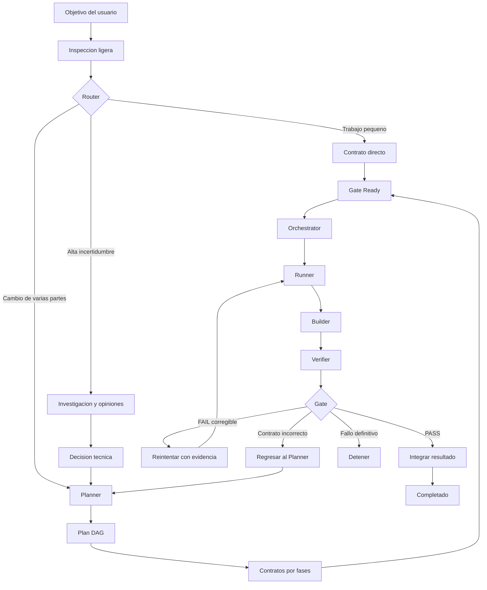
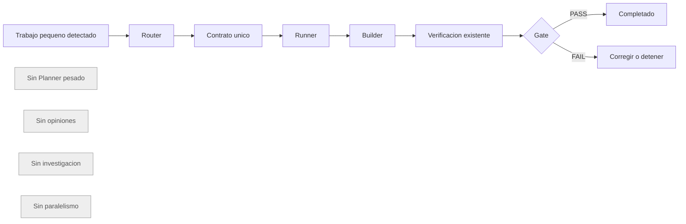
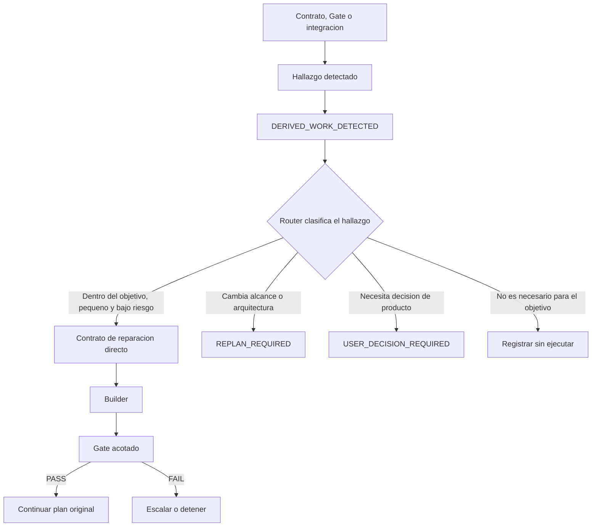
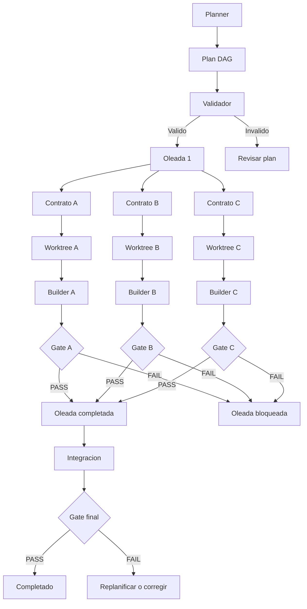
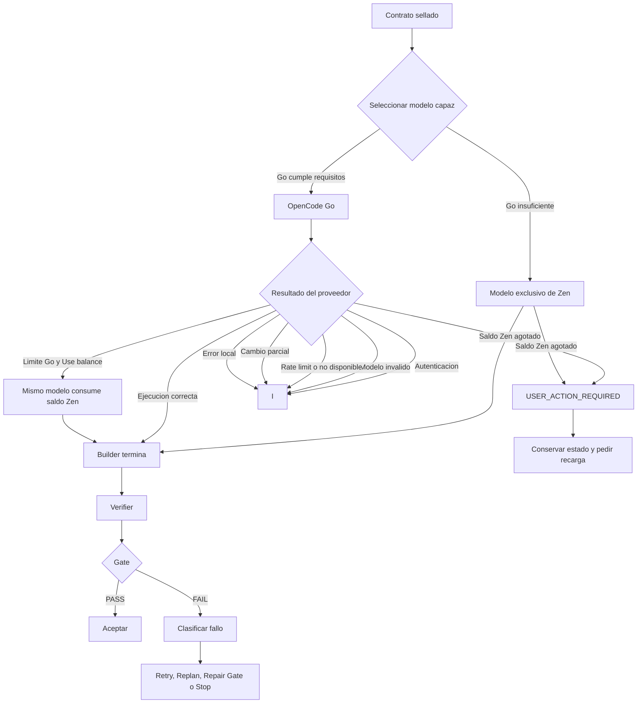
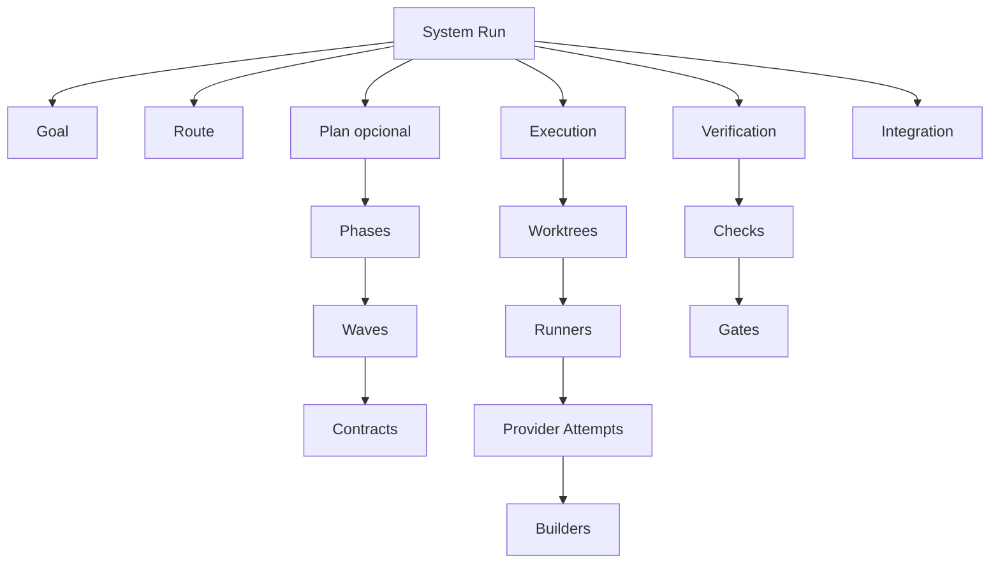

# Jerarquia de eventos

Este documento representa graficamente el routing, la planificacion paralela,
la ejecucion del Runner y la verificacion del sistema de generacion de codigo.

## Flujo general



## Ruta directa



El trabajo pequeno puede proceder directamente del usuario o ser descubierto
por el Orchestrator durante una construccion, verificacion o integracion.

## Trabajo derivado durante la ejecucion



Todo trabajo derivado conserva trazabilidad hacia el contrato y evidencia que
lo originaron. No puede ampliar APIs, dependencias, arquitectura o alcance de
producto sin replanificacion o autorizacion del usuario.

## Plan paralelo



## Runner Go con Use balance



## Jerarquia operativa



## Regla de proteccion

El Router siempre se ejecuta antes del Planner:

```text
Router antes del Planner
```

Un trabajo pequeno, venga del usuario o sea descubierto durante la ejecucion,
toma la ruta directa y no activa investigacion, opiniones, planificacion pesada
ni paralelismo. El Planner y el fan-out se reservan para trabajos con varias
partes, dependencias o incertidumbre demostrable.

## Estados del orquestador

`orchestrate.mjs` registra en `.codegen-run/<run>/events.jsonl` los eventos de
este documento y termina en uno de estos estados:

```text
COMPLETED             gate final PASS; resultado en la rama codegen/<run>
FINAL_GATE_FAILED     oleadas integradas, pero el gate final falló
DELIBERATION_REQUIRED el Goal sigue abierto: investigación, opiniones o decisiones
ROUTE_BLOCKED         Goal no sellado o sin presupuesto para la ruta
PLAN_FAILED | PLAN_INVALID | PLAN_STALE
GATE_NOT_READY        ningún gate confiable para un contrato
BUILD_FAILED          presupuesto de intentos agotado
REPLAN_REQUIRED       el Builder devolvió BLOCKED: el contrato es incorrecto
USER_ACTION_REQUIRED  saldo Zen agotado; recargar y reanudar
ESCALATE              rate limit o proveedor Go no disponible
BLOCKED               credenciales, modelo mal configurado o error local
INTEGRATION_CONFLICT  cherry-pick en conflicto (no debería ocurrir con un plan válido)
```
