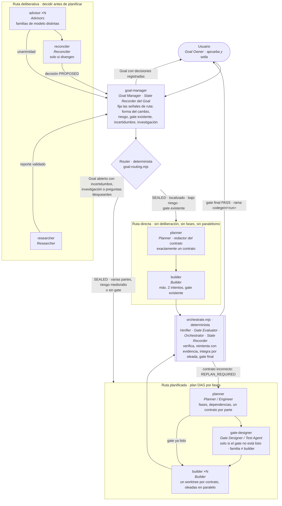

# Flujograma actual de generación de código

Solo los agentes que intervienen, en el orden en que actúan, y la ruta que el
Router elige según la dificultad del Goal. Debajo de cada agente, los roles de
`CODE_GENERATION_FLOW.md` §3 que cumple. Lo que no es agente (router, gates,
worktrees, integración) lo hace código determinista.

| Ruta | Cuándo | Qué se salta |
|---|---|---|
| Directa | Goal sellado, cambio localizado, riesgo bajo, gate existente | investigación, opiniones, fases, paralelismo |
| Planificada | Goal sellado con varias partes, riesgo medio/alto o sin gate | investigación y opiniones |
| Deliberativa | Goal abierto con incertidumbre arquitectónica, investigación externa o preguntas bloqueantes | nada; termina en decisiones que el usuario sella |

## Roles por agente

| Agente (`.opencode/agents/`) | Roles que cumple | Modelo por defecto |
|---|---|---|
| `goal-manager` | Goal Manager; registra decisiones y reportes en el Goal | Go `glm-5.3`; Zen solo si Go no cubre requisitos |
| `researcher` | Researcher | pool Go-preferido `research-synthesis` |
| `advisor` | Advisors / Opinion Agents, una instancia por familia | pool Go-preferido `independent-analysis` |
| `reconciler` | Reconciler, solo con divergencia | tercera familia Go o Zen elegible |
| `planner` | Planner / Engineer y redactor del contrato | Go `glm-5.3`; Zen por capacidad |
| `gate-designer` | Gate Designer / Test Agent | pool Go-preferido del Builder, excluyendo su familia |
| `builder` | Builder | Go `minimax-m3`; Zen por capacidad |

## Roles sin agente

| Rol | Quién lo cumple |
|---|---|
| Goal Owner | el usuario, con `--allow-sealed true` |
| Router | `goal-routing.mjs` |
| Model Selector | `model-selection.mjs` + `model-pools.json` |
| Runner | `run-*.mjs` + `builder-runner.mjs` (Go preferido; Zen por capacidad; sin fallback por cuota) |
| Verifier y Gate Evaluator | `gate.mjs`, `run-builder.mjs`, `final-gate.mjs` |
| Orchestrator y State Recorder | `orchestrator.mjs` (`state.json`, `events.jsonl`) |
| Reconciler con unanimidad | `reconcileOpinions` en `opinions.mjs` |
| Reviewer semántico | no existe todavía |
